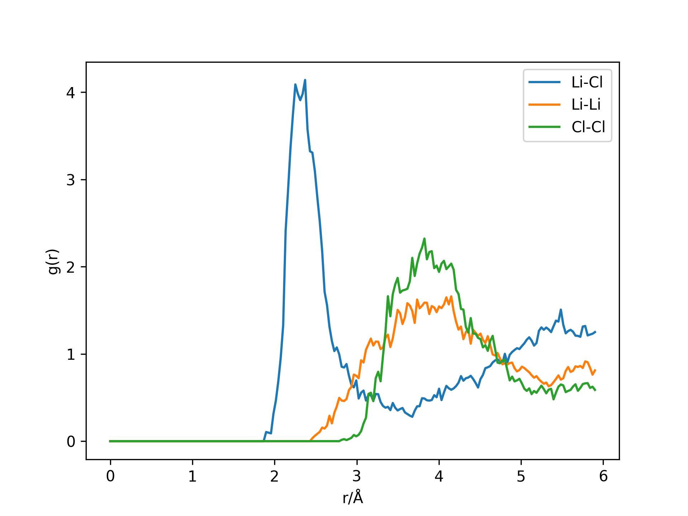

# ABACUS 第一性原理计算

对于LiCl熔体，我们还可以使用ABACUS(Atomic-orbital Based Ab-initio Computation at UStc) 软件进行第一性原理计算。ABACUS是一个基于密度泛函理论（DFT）的材料模拟软件，可以准确地计算原子间相互作用。通过使用ABACUS，我们可以从电子结构层面研究LiCl熔体的性质。

## 目的

学习完本课程后你应该：

- 熟悉ABACUS软件的输入和输出文件；
- 为LiCl熔体编写ABACUS SCF计算输入文件并进行计算；
- 为LiCl熔体编写ABACUS MD计算输入文件并进行计算。

## 资源

在本教程中，我们以LiCl熔体分子为例,进行ABACUS 第一性原理计算。我们已经在`work/ex2`中准备了需要的文件。
```
wget --content-disposition https://github.com/LiangWenshuo1118/LiCl/raw/main/work.tar.gz
tar zxvf work.tar.gz
```

在work/ex2文件夹中存在如下5种文件：
- INPUT：包含了计算过程中所需的各种参数，定义和控制计算任务；
- KPT：包含了布里渊区积分所需的k点信息；
- STRU：包含了原子种类、原子位置、晶格常数以及晶格向量等信息；
- *.upf：包含了原子的赝势信息；
- *.orb：包含了原子轨道的数值表示。

本教程采用 ABACUS v3.1.0 完成。 使用Bohrium registry.dp.tech/dptech/dpgen:0.10.6 管理节点和 registry.dp.tech/dptech/abacus:3.1.0 镜像。

## 作业

### 作业1 ABACUS SCF计算

首先，我们将使用ABACUS软件为LiCl熔体执行自洽（SCF）计算。

#### 输入文件

我们需要准备以下输入文件：

1. INPUT。INPUT文件包含了与LiCl熔体SCF计算的相关参数。示例如下：

```
INPUT_PARAMETERS

#Parameters (1.General)
ntype                   FILL        # 填写提示：ntype指定原子种类的数量
symmetry                FILL        # 填写提示：symmetry指定是否使用晶体对称性
vdw_method              FILL        # 填写提示：vdw_method指定范德华力的计算方法，这里可以选择其中一种方法

#Parameters (2.Iteration)
ecutwfc                 FILL        # 填写提示：ecutwfc指定平面波基组截断能
scf_thr                 FILL        # 填写提示：scf_thr指定电荷密度的收敛阈值
scf_nmax                FILL        # 填写提示：scf_nmax指定自洽场迭代的最大步数

#Parameters (3.Basis)
basis_type              FILL        # 填写提示：basis_type指定基组类型，这里选择线性组合原子轨道（LCAO）                     

#Parameters (4.Smearing)
smearing_method         FILL        # 填写提示：smearing_method指定展宽方法，这里选择高斯展宽（gauss）
smearing_sigma          FILL        # 填写提示：smearing_sigma指定展宽

#Parameters (5.Mixing)
mixing_type             FILL        # 填写提示：mixing_type指定电荷密度混合方法，这里选择Pulay混合
mixing_beta             FILL        # 填写提示：mixing_beta指定混合参数，这里设为0.4

#Parameters (6.sfc)
calculation             FILL        # 填写提示：calculation指定任务类型，这里设为自洽计算   
cal_force               FILL        # 填写提示：cal_force指定是否计算原子受力，这里选择计算
cal_stress              FILL        # 填写提示：cal_stress指定是否计算应力，这里选择计算
```
请结合填写提示，完成LiCl熔体SCF计算的INPUT文件。参数详细解释，请访问ABACUS手册的[INPUT完整参数列表](http://abacus.deepmodeling.com/en/latest/advanced/input_files/input-main.html)部分。

2. STRU。STRU文件包含了LiCl熔体的原子种类、原子位置、晶格常数以及晶格向量等信息。考虑到DFT计算成本相对较高，这里设计了一个较小的计算体系（64原子）。示例如下：

```
ATOMIC_SPECIES
Li 6.941 Li_ONCV_PBE-1.2.upf           # 元素，原子质量，使用的赝势文件
Cl 35.453 Cl_ONCV_PBE-1.2.upf

NUMERICAL_ORBITAL
Li_gga_8au_100Ry_4s1p.orb              # 数值轨道文件
Cl_gga_8au_100Ry_2s2p1d.orb

LATTICE_CONSTANT
1.889726                               # 1.889726 Bohr = 1.0 Angstrom

LATTICE_VECTORS
11.858 0.0 0.0                         # 晶格向量
0.0 11.858 0.0 
0.0 0.0 11.858 

ATOMIC_POSITIONS
Cartesian                              # 以笛卡尔坐标表示（Cartesian），单位为晶格常数
Li                                     # 元素名称
0.0                                    # 元素磁性
32                                     # 原子个数
3.01682  1.77597  4.37873  1  1  1     # 每个原子x，y，z方向的坐标和约束条件（1表示允许在该方向上移动，0表示固定）
3.47660  5.23243  2.05957  1  1  1
0.90851  3.90744  4.56133  1  1  1
...（省略）
Cl
0.0
32
2.40263  3.44380  3.15593  1  1  1
4.71432  5.62464  3.99601  1  1  1
5.02722  1.62164  4.70153  1  1  1
...（省略）

```

3. KPT。KPT文件包含了LiCl熔体SCF计算的k点设置，示例如下：

```
K_POINTS
0
Gamma
1 1 1 0 0 0
```

4. upf和orb文件。对于Li和Cl，分别采用Li_ONCV_PBE-1.2.upf和Cl_ONCV_PBE-1.2.upf，以及Li_gga_8au_100Ry_4s1p.orb和Cl_gga_8au_100Ry_2s2p1d.orb。Li和Cl的赝势和轨道文件可以从ABACUS官网下载。

#### 执行计算

准备好以上所有输入文件后，我们可以执行LiCl熔体的SCF计算。例如，使用命令行：

```
OMP_NUM_THREADS=1 mpirun -np 16 abacus
```

主要的计算信息被储存在文件OUT.ABACUS/running_scf.log中，该文件内容如下：
```

                                                                                     
                             WELCOME TO ABACUS v3.0                                  
                                                                                     
               'Atomic-orbital Based Ab-initio Computation at UStc'                  
                                                                                     
                     Website: http://abacus.ustc.edu.cn/                             
                                                                                     
    Version: Parallel, in development
    Processor Number is 16
    Start Time is Fri Mar 17 11:12:54 2023
                                                                                     
 ------------------------------------------------------------------------------------

...（省略）

 LCAO ALGORITHM --------------- ION=   1  ELEC=   1--------------------------------

 Density error is 0.104045211662

       Energy                       Rydberg                            eV
   E_KohnSham                 -1429.2427444                 -19445.845149
     E_Harris                -1430.40301784                 -19461.631479
      E_Fermi              +0.0524155151601               +0.713149669783

...（省略）

 LCAO ALGORITHM --------------- ION=   1  ELEC=  11--------------------------------
 Memory of pvpR : 2.89599609375 MB

 Density error is 7.23978511026e-08

       Energy                       Rydberg                            eV
   E_KohnSham                -1429.41030086                -19448.1248715
     E_Harris                -1429.41030086                -19448.1248715
       E_band                -310.415111989                -4223.41426836
   E_one_elec                -849.674984163                -11560.4212327
    E_Hartree                +459.864819535                +6256.78185542
         E_xc                -294.061400137                -4000.91060373
      E_Ewald                -744.876355072                -10134.5627344
      E_demet            -3.01381081966e-88            -4.10049998414e-87
      E_descf                            +0                            +0
      E_vdwD3                -0.66238101901                -9.01215610558
        E_exx                            +0                            +0
      E_Fermi              +0.0508640615939                 +0.6920410611

 charge density convergence is achieved
 final etot is -19448.1248715 eV

...（省略）

```

可以看到，经过11次迭代后，电荷密度收敛，密度误差达到7.23978511026e-08，最终总能量为-19448.1248715 eV。

在这个作业中，我们熟悉了ABACUS软件的输入文件，学会了如何为LiCl熔体编写ABACUS SCF计算输入文件，执行计算并查看计算收敛情况。

注意：使用LCAO基组计算时，通常需测试能量、力、应力对不同轨道半径截断值和不同k点（k_spacing）设置的收敛性。出于简化教程的目的，这里我们没有做这样的测试。

### 作业2 ABACUS MD计算

接下来，我们将使用ABACUS软件为LiCl熔体执行分子动力学（MD）计算。

#### 输入文件

我们需要修改INPUT文件，而其他文件无需更改。INPUT文件示例如下：

```
INPUT_PARAMETERS

#Parameters (1.General)
ntype           2              
symmetry        0                      
vdw_method      d3_bj          

#Parameters (2.Iteration)
ecutwfc         100            
scf_thr         1.0e-7         
scf_nmax        120            

#Parameters (3.Basis)        
basis_type      lcao           
          
#Parameters (4.Smearing)
smearing_method	gauss          
smearing_sigma	0.002          

#Parameters (5.Mixing)
mixing_type	pulay          
mixing_beta	0.4            

#Parameters (6.md)
calculation     FILL            # 填写提示：calculation指定计算类型，这里选择分子动力学
cal_force       1              
cal_stress      1              
md_nstep        FILL            # 填写提示：md_nstep指定分子动力学模拟的总步数，设为500
md_type         FILL            # 填写提示：md_type指定模拟类型，这里选择NVT系综
md_dt           FILL            # 填写提示：md_dt指定时间步长
md_tfirst       FILL            # 填写提示：md_tfirst指定目标温度
md_restart      FILL            # 填写提示：md_restart指定是否为续算，这里不是续算
md_dumpfreq     FILL            # 填写提示：md_dumpfreq指定输出分子动力学信息的频率，这里每一步都输出
out_stru        FILL            # 填写提示：out_stru指定输出结构信息的选项，这里输出
```
INPUT文件定义了LiCl熔体的分子动力学（MD）模拟。与之前的LAMMPS MD一致，模拟在NVT系综下进行，时间步长1fs，温度为900 K。考虑到DFT计算成本相对较高，这里模拟时间为1ps。

#### 执行计算

准备好以上所有输入文件后，我们可以执行LiCl熔体的MD计算。例如，使用命令行：

```
OMP_NUM_THREADS=1 mpirun -np 16 abacus
```

上面已经介绍，主要的计算信息被储存在文件OUT.ABACUS/running_scf.log中。除此之外，MD模拟的轨迹被存储在文件OUT.ABACUS/MD_dump中。MD_dump文件内容如下：
```
MDSTEP:  0
LATTICE_CONSTANT: 1.889726124626
LATTICE_VECTORS
  11.858000000000  0.000000000000  0.000000000000
  0.000000000000  11.858000000000  0.000000000000
  0.000000000000  0.000000000000  11.858000000000
VIRIAL (KBAR)
  14.314395848598  0.068950391132  -1.646206932245
  0.068950391132  6.742623812696  -3.705349135941
  -1.646206932245  -3.705349135941  5.270646592369
INDEX    LABEL    POSITIONS    FORCE (eV/Angstrom)
  0  Li  3.016819999993  1.775969999997  4.378729999996  -0.812213164484  -0.585472450641  0.311819994732
  1  Li  3.476600000010  5.232430000004  2.059570000010  0.352252495274  -0.175519926585  0.080617217948
  2  Li  0.908510000006  3.907440000006  4.561330000000  -0.649106916034  0.039426589767  0.878683371838
  ...
  61  Cl  10.362100000004  9.238389999995  8.344720000004  -2.421125883128  0.103626611523  -1.137264969726
  62  Cl  9.088940000007  5.618780000000  9.584660000001  -0.546302523476  -2.531252034211  0.628161793135
  63  Cl  8.152059999999  7.237340000007  6.577169999999  -0.867749328458  -2.567100713260  0.810628619279
```
该文件记录了分子动力学模拟的信息。包括：
- MD的步数（MDSTEP）
- 晶格常数（LATTICE_CONSTANT）和晶格矢量（LATTICE_VECTORS）。
- 应力张量（VIRIAL），单位KBAR。
- 每个原子的索引、标签、坐标位置（POSITIONS）和受到的力（FORCE），力的单位eV/Angstrom。

这里提供了一个名为abacus_md_rdf.py的python脚本，可以提取原子坐标，计算RDF并将RDF数据保存到名为gr_Li-Cl、gr_Li-Li和gr_Cl-Cl、文件。

```python
import numpy as np
import matplotlib.pyplot as plt

# 读取轨迹文件，返回Li和Cl坐标数组
def get_atom_positions(file_path,nLi,nCl):                
    Li, Cl = [], []
    with open(file_path, 'r') as file:
        for line in file:
            if 'Li' in line:
                Li.append([float(line.split()[2]), float(line.split()[3]), float(line.split()[4])])
            if 'Cl' in line:
                Cl.append([float(line.split()[2]), float(line.split()[3]), float(line.split()[4])])
    return np.array(Li).reshape(-1, nLi, 3), np.array(Cl).reshape(-1, nCl, 3)

# 根据Li和Cl坐标数组计算RDF
def get_gr(x, y, L):                                     
    batchsize, n, dim = x.shape[0], x.shape[1], x.shape[2]
    
    i,j = np.triu_indices(n, k=1)
    rij = (np.reshape(x, (-1, n, 1, dim)) - np.reshape(y, (-1, 1, n, dim)))[:,i,j]
    rij = rij - L*np.rint(rij/L)
    dist = np.linalg.norm(rij, axis=-1) # (batchsize, n*(n-1)/2)
   
    hist, bin_edges = np.histogram(dist.reshape(-1,), range=[0, L/2], bins=200)
    dr = bin_edges[1] - bin_edges[0]
    hist = hist*2/(n * batchsize)

    rmesh = np.arange(hist.shape[0])*dr
    
    h_id = 4/3*np.pi*n/(L**3)* ((rmesh+dr)**3 - rmesh**3 )
    return rmesh, hist/h_id

# 指定体系基本信息，调用get_atom_positions()函数获得坐标数组
L = 11.858
nLi,nCl=32,32  
Li, Cl = get_atom_positions('./OUT.ABACUS/MD_dump',nLi,nCl)

# 调用get_gr()计算RDF，并绘制和保存RDF
atom_pairs = {'Li-Cl': (Li, Cl),'Li-Li': (Li, Li),'Cl-Cl': (Cl, Cl)}
for label, (x, y) in atom_pairs.items():
    rmesh, gr = get_gr(x, y, L)
    plt.plot(rmesh, gr, label=label)
    np.savetxt(f'gr_{label}', np.column_stack((rmesh, gr)))
plt.legend()
plt.savefig('abacus_md_rdf',dpi=300)
```
从ABACUS MD计算的RDF如下。我们可以观察ABACUS和LAMMPS MD获得的900K下的LiCl熔体的RDF是否存在差异。注意，由于模拟体系较小和模拟时间较短，ABACUS MD计算的RDF曲线并不光滑，更大的模拟体系或者更长的模拟时间将有助于改善这一情况。



在这个作业中，我们学习了如何为LiCl熔体编写ABACUS MD计算输入文件，执行计算，和MD轨迹处理。


