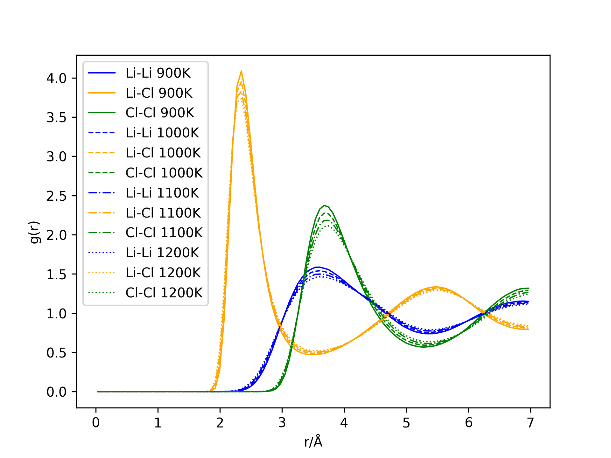

# LAMMPS 深度势能分子动力学研究

在训练好DP模型后，我们可以将其应用于LAMMPS软件中，以便更高效地模拟LiCl熔体的性质。这使得我们能够在大尺度和长时间尺度上研究LiCl熔体的结构、动力学和热力学性质，从而获得关于材料行为的更深入理解。

## 目的

学习完本课程后你应该：

- 能够利用循环方式进行LAMMPS模拟；
- 能够进行LiCl熔体的NPT和NVT计算。

## 资源

在本教程中，我们以LiCl熔体分子为例。我们已经在`work/ex5`中准备了需要的文件。

```sh
wget --content-disposition https://github.com/LiangWenshuo1118/LiCl/raw/main/work.tar.gz
tar zxvf work.tar.gz
```

首先，使用 `tree` 命令查看 `work/ex5` 文件夹。

```sh
$ tree ex5_MLMD_LAMMPS -L 2  
```

你应该可以在屏幕上看到输出：

```sh
ex5_MLMD_LAMMPS
|-- 01.nvt
|   `-- in.licl_nvt
`-- 00.npt
    |-- in.licl_npt
    `-- licl.data
```

- `in.licl*` 和 `licl.data` 是 LAMMPS 的输入文件

本教程采用 DeePMD-kit(2.1.5)软件包中预置的 LAMMSP 程序完成。

## 练习

### 练习1 NPT-MD模拟

我们在ex4/iter.000002/01.train/*文件夹中可以找到最终的4个DP模型。通过`dp compress`命令，可以将模型压缩，并命名压缩后的模型为licl_compress_0.pb到licl_compress_3.pb。将压缩后的模型分别复制到00.npt和01.nvt文件夹。接下来，我们进行LAMMPS NPT-MD模拟，以预测LiCl熔体的密度。LiCl熔体LAMMPS NPT-MD的控制文件如下：

```
variable        a loop 4 pad
variable        b equal $a-1
variable        f equal $b*100
variable        t equal 900+$f

log             log$t.lammps

units           metal
boundary        p p p
atom_style      atomic

read_data       licl.data
replicate       2 2 2 
mass            1 6.94
mass            2 35.45

pair_style      deepmd ./licl_compress_0.pb ./licl_compress_1.pb ./licl_compress_2.pb ./licl_compress_3.pb  out_freq 100 out_file model_devi$t.out
pair_coeff  	* *	

velocity        all create $t 23456789

fix             1 all npt temp $t $t 0.1 iso 0 0 0.5
timestep        0.001

thermo_style    custom step temp pe ke etotal press density lx ly lz vol
thermo          100 

run             1000000
write_data      licl.data$t

clear
next            a
jump            in.licl_npt
```

与ex1的in.licl相比，有几点需要解释：

`variable a loop 4 pad`：创建一个名为a的变量，并通过loop命令在脚本中循环4次。变量 a 将在循环过程中依次取值 1, 2, 3 和 4。

`variable b equal $a-1`：创建一个名为b的变量，其值等于a减1。这意味着在循环中，b的值将从0开始，直到3。

`variable f equal $b*100`：创建一个名为f的变量，其值等于b乘以100。在循环过程中，f的值将是0、100、200和300。

`variable t equal 900+$f`：创建一个名为t的变量，其值等于900加上f。在循环过程中，t的值将是900、1000、1100和1200。

`replicate`  2 2 2：表示沿x、y和z方向将原始系统复制一次。这将使得模拟体系由64原子增大至512原子。

`pair_style  deepmd ./licl_compress_0.pb ./licl_compress_1.pb ./licl_compress_2.pb ./licl_compress_3.pb  out_freq 100 out_file model_devi$t.out`: 加载了4个神经网络模型,每100个时间步输出一次模型偏差到名为model_devi$t.out的文件，其中$t表示温度。

`thermo_style custom step temp pe ke etotal press density lx ly lz vol`: 在thermo_style中增加了density，便于计算模拟体系的密度。

`write_data licl$t.data`: 每次模拟结束时，将模拟体系的信息写入名为 `licl$t.data` 的文件中。

`jump in.licl_npt`: 每次模拟结束后，脚本会清除之前的设置，并跳回到输入文件的开头，准备开始下一次模拟。


我们提供了一个名为log_lammps.py的python脚本，可以从LAMMPS NPT中获取盒子边长和密度信息。

```python
import numpy as np

# 计算指文件某一列的平均值
def calculate_mean(file_name, column_name):
    with open(file_name, 'r') as file:
        lines = file.readlines()
    
    # 确定thermo_style开始和结束的行
    step_line = next(i for i, line in enumerate(lines) if 'Step' in line)
    loop_line = next(i for i, line in enumerate(lines) if 'Loop' in line)

    column_index = lines[step_line].split().index(column_name)
    data = [float(line.split()[column_index]) for line in lines[step_line+1:loop_line]]

    mean = sum(data[2001:]) / len(data[2001:])      # 计算平均值时跳过前 200000 md 步

    return mean

temps=[900,1000,1100,1200]
for temp in temps:
    mean_density = calculate_mean(f'log{temp}.lammps', 'Density')          
    mean_Lx = calculate_mean(f'log{temp}.lammps', 'Lx')
    print(round(mean_density,3), round(mean_Lx,15))

```
预测密度如下：

表5.1 不同温度下，LiCl熔体的计算密度和相应模拟盒子的边长。
| T(K) |Density(g/cm3)|     Lx           |
|------|--------------|------------------| 
| 900  | 1.602        |22.405256609375005|
| 1000 | 1.562        |22.596664576249935|
| 1100 | 1.523        |22.789268989874945|
| 1200 | 1.485        |22.981117881750063|


### 练习2 NVT-MD模拟

根表5.1中Lx的数值调整LAMMPS NPT-MD 模拟产生的licl.data$t文件中模拟盒子的边长。接下来，进行LAMMPS NVT-MD模拟，以预测LiCl熔体的结构信息和离子扩散系数。LiCl熔体LAMMPS NVT-MD的控制文件如下：

```
variable        a loop 4 pad
variable        b equal $a-1
variable        f equal $b*100
variable        t equal 900+$f

log             log$t.lammps

units           metal
boundary        p p p
atom_style      atomic

read_data	licl$t.data
#replicate       2 2 2 
mass 		1 6.94
mass		2 35.45
group		Li  type 1
group		Cl  type 2


pair_style	deepmd ./licl_compress_0.pb ./licl_compress_1.pb ./licl_compress_2.pb ./licl_compress_3.pb  out_freq 100 out_file model_devi$t.out
pair_coeff  	* *	

velocity        all create $t 23456789

fix             1 all nvt temp $t $t 0.5
timestep        0.001

# rdf calculation 
compute 	 rdf all rdf 100 1 1 1 2 2 2
fix 		 2 all ave/time 100 1 100 c_rdf[*] file licl$t.rdf mode vector

# msd calculation
compute          msd1 Li msd
compute          msd2 Cl msd
fix              3 all ave/time 100 1 100 c_msd1[4] c_msd2[4] file licl$t.msd

thermo_style    custom step temp pe ke etotal press density lx ly lz vol
thermo          100 

dump		1 all custom 100 licl$t.dump id type x y z

run             1000000

clear
next            a
jump            in.licl
```
我们可以利用ex1中提供的python脚本，从licl$t.rdf和licl$t.msd中获得径向分布函数和离子自扩散系数。

预测径向分布函数如下：



表5.2 不同温度下，LiCl熔体的中Li-Li，Li-Cl和Cl-Cl离子对径向分布函数第一峰的位置。
| T(K) |Li-Li   |Li-Cl   |Cl-Cl   |
|------|--------|--------|--------| 
| 900  | 3.605  |2.345   |3.675   |
| 1000 | 3.605  |2.345   |3.675   |
| 1100 | 3.605  |2.345   |3.745   |
| 1200 | 3.605  |2.345   |3.745   |

预测均方位移和离子扩散系数如下：


表5.3 不同温度下，LiCl熔体的中$Li^{+}$和$Cl^{-}$离子的扩散系数。
| T(K) |$D_{Li^{+}}\left(m^2 / s \times 10^{-9}\right)$|$D_{Cl^{-}}\left(m^2 / s \times 10^{-9}\right)$|
|------|------------------------------------------------|----------------------------------------------| 
| 900  | 8.48         |3.28  |
| 1000 | 10.78        |4.59  |
| 1100 | 12.54        |5.96  |
| 1200 | 18.07        |8.75  |


我们可以将计算结果和文献[1]进行比较，可以看到计算结构和文献基本吻合。

[1] Journal of Materials Science & Technology 75 (2021) 78–85
